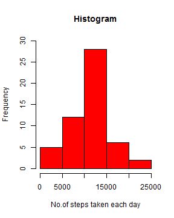
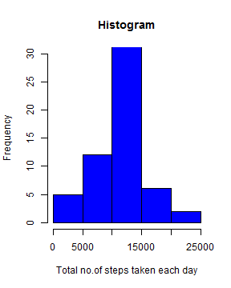

##Introduction
The data used for this assignment is stored in a csv file named "activity.csv".
Data was recorded on a personal monitoring device. The data include the number
of steps taken by an individual in 5 minute intervals each day, over a period of
two months, october and november 2012. 
There are three variables in the dataset 
(i) steps :no. of steps taken in the interval
(ii) date : date on which the data was recorded
(iii) interval : a 5 minute interval between 0 and 2355


```r
rawdata <- read.csv("activity.csv")
str(rawdata)
```

```
## 'data.frame':	17568 obs. of  3 variables:
##  $ steps   : int  NA NA NA NA NA NA NA NA NA NA ...
##  $ date    : Factor w/ 61 levels "2012-10-01","2012-10-02",..: 1 1 1 1 1 1 1 1 1 1 ...
##  $ interval: int  0 5 10 15 20 25 30 35 40 45 ...
```

The data is read and stored as a dataframe callled rawdata.

## Mean total number of steps taken per day
The first part of this assignment is to calculate total number of steps taken 
each day and plot the corresponding histogram. The height of each bar in the 
histogram represents no. of days that have the total number of steps taken 
on each day in a particular interval.(e.g 5 days corresponding to 0-5000 steps) 


```r
rawdata <- read.csv("activity.csv")
#------------------------------------------------------------------------
## part1 -calculate no on steps per day and plot histogram
## finding out total numer of steps taken for each day
data1 <- rawdata[!is.na(rawdata),]  # removing NA values.
## finding out total numer of steps taken for each day
ts <- tapply(data1$steps, data1$date, FUN=sum, simplify = TRUE)
hist(ts, xlab= "No.of steps taken each day", ylim=c(0,30),main="Histogram", 
     col="red")
```



```r
mts <-mean(ts, na.rm = TRUE) 
print(round(mts))  ## rounded because the no of steps shoud be in integer
```

```
## [1] 10766
```

```r
mdts <- median(ts,na.rm = TRUE)
print(round(mdts))
```

```
## [1] 10765
```


The mean of the number of steps taken each day is 1.0766189 &times; 10<sup>4</sup> and the meadian 
is 10765.

## Average daily activity pattern
Furthermore, the average of steps taken for every 5 minute interval averaged 
over all the days is plotted against the intervals ranging from 0 till 2355.
It gives us an idea of average daily activity.


```r
### part2 - calculate avaerage steps for each interval (averaged over all days) 
## use invervals as fcators and find the average steps for each interval
interval <- factor(data1$interval)
avgsteps <-tapply(data1$steps, factor(data1$interval), FUN=mean, simplify = TRUE)
data2 <- cbind.data.frame(as.numeric(levels(interval)), as.numeric(avgsteps))
colnames(data2) <- c("interval", "avgsteps")
# plotting the data 
plot(data2$interval,data2$avgsteps, type = 'l', lwd=2, 
       xlab = "Intervals", ylab = "Average no of steps taken",
         main= "Average Daily Activity Pattern")
```


```r
## sort the data and find interval correspondig to maximum of avg steps
data2 <- data2[order(data2$avgsteps, decreasing=TRUE),] 
maxint <- data2[1,1] 
maxstep <- as.integer(data2[1,2])
```

As it is seen from the graph, the maximum number of average steps taken in an  
interval is 206 and the corresponding time interval is 835. 

## Imputing missing values
So far, we have not considered the NA values in the given dataset.


```r
### find out no of missing values in the dataset.
nadata <- subset(rawdata, is.na(steps)== TRUE)
narows <- nrow(nadata)
nadays <- length(levels(factor(nadata$date)))
```
 However there are 8 days where no. of steps taken are not available. 
 There are 2304 missing values in total. If these missing values are not 
 replaced, the calculations made on the dataset will be biased. Hence, I propose
 to replace the missing values with the average of steps taken for that 
 particular interval taken over all days (calculated previously).
 
### Replacing NA values
Now, *avgsteps* in *data2* dataframe stores the average no. ofsteps for each 
interval : 288.     
Dataframe *nadata* contains 2304 rows = 288 * 8.   
Since in this particular case ALL the 288 values are missing for each of the 
8 days, I can just column-bind *avgsteps* in *data2* and *date* and 
*interval* columns in *nadata*. Here, *avgsteps* will repeat itself 8 times, 
until all the columns are complete. The resulting dataframe is called 
*nareplace*.  


```r
### replace NA with avg steps taken for that interval
nareplace <- cbind.data.frame(as.numeric(avgsteps),nadata$date,nadata$interval)
colnames(nareplace) <- colnames(data1)
## data1: data for all the days with non-NA values for "steps" in  rawdata.

### row-bind data1 and nareplace, order according to date
newdata <- rbind.data.frame(data1,nareplace)
newdata <- newdata[order(newdata$date),]
```
Furthermore, I have combined the two dataframes, (i)*data1* : data for the days
which had no NA values (ii) *nareplace* : newly created data for days which
had NA values. Thus, the dataset is complete for all the days.   

Let's plot the histogram of total no. steps taken per day and compute the 
mean and median for that.

```r
## finding out total numer of steps taken for each day
newts <- tapply(newdata$steps, newdata$date, FUN=sum, simplify = TRUE)
hist(newts, xlab= "Total no.of steps taken each day", ylim=c(0,30),main="Histogram", 
     col="blue")
```



```r
newmts <-round(mean(newts, na.rm = TRUE)) 
print(round(newmts))
```

```
## [1] 10766
```

```r
newmdts <- median(newts,na.rm = TRUE)
print(round(newmdts))
```

```
## [1] 10766
```
So, in the new dataframe called *newdata*, all the days (which had missing
values in the rawdata), will have avg.values of steps taken 
corresponding to each interval.

The mean  and the median of total number of steps taken per day are 
1.0766 &times; 10<sup>4</sup> and 1.0766189 &times; 10<sup>4</sup> respectively. The mean and the meadin are equal and 
meadian differs just by one digit from that calculated in the first part. 

## Difference in activity patterns : weekday and weekend

To monitor the difference between the activity patterns between weekdays and 
weeknends, a factor variable called *date.f* which categorizes the days of the 
week into weekday and weekend is created.  

Then the mean of steps taken with respect to combination of two factors : 
(i)factor related to the interval of the day (ii) date.f relating to day of the
week. 

The avg of steps taken in each interval is plotted against the intervals, for 
weekday and weeknds separately. You can see the graphs below.  


```r
## creating a new factor variable date.f to categorize weekdays and weekends 
newdata$date<- as.Date(as.character(newdata$date))
wday1 <- c("Monday", "Tuesday", "Wednesday", "Thursday", "Friday")
date.f <- factor((weekdays(newdata$date) %in% wday1), 
                   levels=c(TRUE,FALSE), labels=c("Weekday", "Weekend"))

### adding the new factor varible date.f to the dataframe newdata
### and calculate avg no of steps taken in each interval on weekday and on 
### weekend.
newdata1 <- cbind(newdata,date.f)
navg <-tapply(newdata1$steps, list(newdata1$date.f,factor(newdata1$interval)), 
              FUN=mean, simplify = TRUE)


navg <- t(navg) ## taking transpose, easy for plotting
interval <- as.numeric(levels(factor(newdata1$interval)))

navg1 <- cbind.data.frame(interval, navg) #### final data frame for plotting 

### making panel plots in base plotting system
par(mfrow=c(2,1))
plot(navg1$interval,navg1$Weekday, type = 'l', lwd=2, col="blue", 
     xlab = "Intervals", ylab = "Avg. steps",
     main= "Weekday")
plot(navg1$interval,navg1$Weekend, type = 'l', lwd=2, col="blue", 
     xlab = "Intervals", ylab = "Avg. steps",
     main= "Weekend")
```


As you can see from the graphs, there is more activity in the begening of a
weekday, generating a peak around 835 where maximum number of steps is more than
200. Later in the day activity slows down to 50-100 steps roughly. In the 
weekend, activity is quite consistient without having huge fluctuations in the 
avg. no of steps taken. Although the maximum is leass than 200, the steps taken
remain roughly around 100 almost for the rest of the day.


